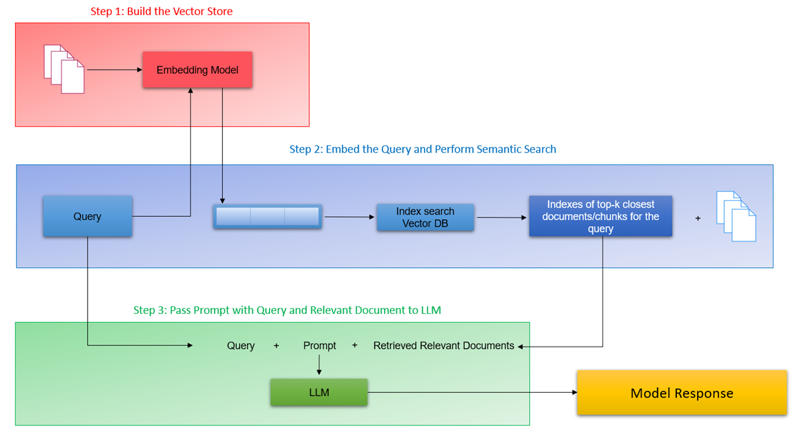

# PolicyMind-AI

PolicyMind AI is a Retrieval-Augmented Generation (RAG) based insurance assistant built using Gemma 4, Gemini Embeddings, and ChromaDB. It helps users instantly understand complex insurance policy documents through semantic search, grounded AI responses, and citation-based answers without manually reading lengthy PDFs.

---
# Getting Started

## Prerequisites
- Python 3.8+
- Google API Key (for Gemini Embeddings and Gemma 4)
- pip

## Installation

1. Clone the repository:
   ```bash
   git clone https://github.com/BrahmamChava/PolicyMind-AI.git
   cd PolicyMind-AI

---


# Problem Statement

Insurance policy documents are often lengthy, technical, and difficult for users to understand. Finding information such as waiting periods, exclusions, claim eligibility, surgical coverage, or policy conditions usually requires manually reading multiple pages of policy documents.

This process is:
- Time-consuming
- Difficult for non-technical users
- Error-prone
- Inefficient during urgent situations

PolicyMind AI solves this problem by allowing users to ask natural language questions and receive grounded, citation-based answers directly from insurance policy documents.

---

# Solution Overview

PolicyMind AI uses a Retrieval-Augmented Generation (RAG) pipeline to retrieve relevant sections from insurance documents and generate context-aware responses using Gemma 4.

Instead of returning entire PDFs or pages, the system:
1. Extracts text from insurance policy documents
2. Splits documents into semantic chunks
3. Generates embeddings using Gemini Embedding models
4. Stores embeddings in ChromaDB
5. Retrieves relevant chunks using semantic similarity
6. Uses Gemma 4 to generate grounded answers with citations

This enables users to quickly understand policy information without manually searching through lengthy documents.

---

# Features

- Insurance Policy Question Answering
- Retrieval-Augmented Generation (RAG)
- Semantic Search using Gemini Embeddings
- Recursive Character Chunking
- Citation-based Responses
- ChromaDB Vector Database
- Grounded AI Responses
- PDF Document Processing
- Metadata-aware Retrieval
- Chunk-level Semantic Retrieval
- Natural Language Query Support

---

# Project Architecture



```text
Insurance PDFs
       ↓
PDF Text Extraction
       ↓
Recursive Character Chunking
       ↓
Gemini Embeddings
       ↓
ChromaDB Vector Store
       ↓
Semantic Retrieval
       ↓
Gemma 4 Response Generation
       ↓
Final Answer with Citations
```

---

# Technologies Used

| Technology | Purpose |
|---|---|
| Gemma 4 | Response Generation |
| Gemini Embeddings (`gemini-embedding-001`) | Semantic Embeddings |
| ChromaDB | Vector Database |
| Python | Backend Development |
| Google Colab | Development Environment |
| pdfplumber | PDF Text Extraction |
| LangChain Text Splitters | Recursive Chunking |
| Pandas | Data Processing |

---

# Folder Structure

```text
PolicyMind-AI/
│
├── PolicyMind_AI.ipynb
├── README.md
├── LICENSE
│
└── PolicyDocuments/
      ├── HDFC-Life-Easy-Health.pdf
      ├── HDFC-Life-Group-Term-Life-Policy.pdf
```

---

# How It Works

## Step 1 — PDF Upload

Insurance policy documents are uploaded into the `PolicyDocuments` folder.

## Step 2 — Text Extraction

The system extracts both regular text and table content from PDFs using `pdfplumber`.

## Step 3 — Recursive Chunking

Large policy pages are split into smaller overlapping chunks using Recursive Character Chunking to improve retrieval precision.

## Step 4 — Embedding Generation

Gemini Embedding models convert chunks into dense vector embeddings.

## Step 5 — Vector Storage

Embeddings and metadata are stored inside ChromaDB for semantic retrieval.

## Step 6 — Semantic Retrieval

When a user asks a question, the system retrieves the most relevant chunks using vector similarity search.

## Step 7 — Response Generation

Gemma 4 uses the retrieved context to generate grounded answers with relevant policy citations.

---

# Sample Questions

- What is the waiting period for cataract treatment?
- Does the policy cover dental treatment?
- Can multiple surgeries be claimed?
- What are the exclusions under this policy?
- Does the policy cover routine eye tests?
- What documents are required for claim submission?
- What surgeries are covered under Category 1?
- Does the policy provide maturity benefits?

---

# Future Improvements

- Streamlit-based Web Interface
- Local Gemma Deployment using Ollama/vLLM
- Multi-policy Comparison
- Voice-based Insurance Assistant
- Hybrid Search (Keyword + Semantic)
- Reranking Pipeline
- Multi-language Support
- Real-time Policy Recommendation System

---

# Author

Brahmam Chava

---

# License

This project is licensed under the MIT License.
